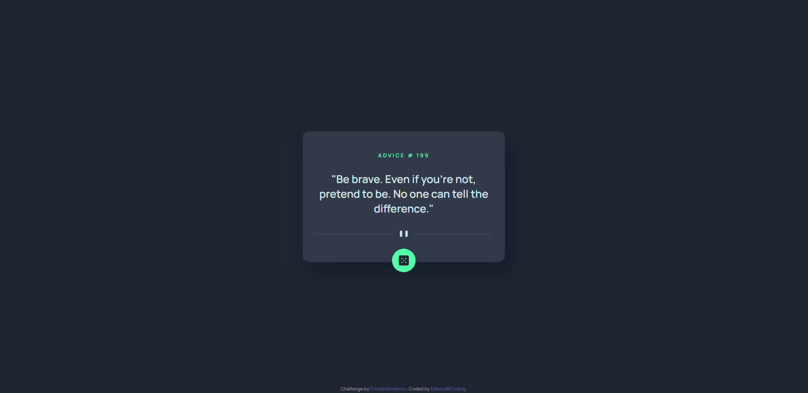

# Frontend Mentor - Advice generator app solution

This is a solution to the [Advice generator app challenge on Frontend Mentor](https://www.frontendmentor.io/challenges/advice-generator-app-QdUG-13db).

## Table of contents

- [Overview](#overview)
  - [The challenge](#the-challenge)
  - [Screenshot](#screenshot)
  - [Links](#links)
- [My process](#my-process)
  - [Built with](#built-with)
  - [What I learned](#what-i-learned)
  - [Continued development](#continued-development)
  - [Useful resources](#useful-resources)
- [Author](#author)
- [Acknowledgments](#acknowledgments)

## Overview

### The challenge

Users should be able to:

- View the optimal layout for the app depending on their device's screen size
- See hover states for all interactive elements on the page
- Generate a new piece of advice by clicking the dice icon

### Screenshot

### Links

- Solution URL: [Link](https://www.frontendmentor.io/solutions/simple-advice-generator-using-native-js-l3P6w2du9h)
- Live Site URL: [Link](https://edwardbcoding.github.io/advice-generator/)

## My process

### Built with

- Semantic HTML5 markup
- CSS custom properties
- Flexbox
- Mobile-first workflow

### What I learned

Being a small project, the main thing I learned was connecting to an api and using promises to pass data to a function.

### Continued development

In my upcoming projects, I want a better grasp on how to manage the data from an api better as well as what json really is and does.

### Useful resources

- [WebDevSimplified on Fetch API](https://www.youtube.com/watch?v=DHvZLI7Db8E&ab_channel=WebDevSimplified) and  [JavaScript Promises](https://www.youtube.com/watch?v=cuEtnrL9-H0&ab_channel=WebDevSimplified) - These two videos gave me a starting point to understand how to use the fetch to grab data from an api.

## Author

- GitHub - [@EdwardBCoding](https://github.com/EdwardBCoding)
- Frontend Mentor - [@EdwardBCoding](https://www.frontendmentor.io/profile/EdwardBCoding)

## Acknowledgments

Thanks to the team over at Frontend Mentor! Having some direction when making a project is super helpful.